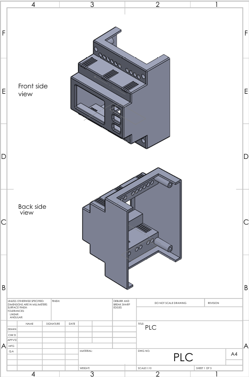
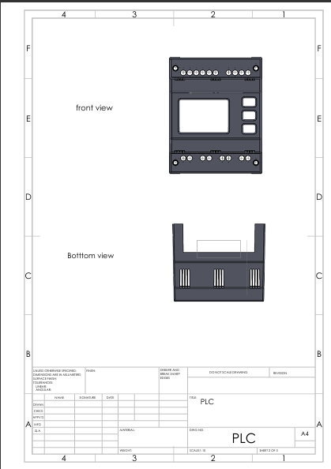
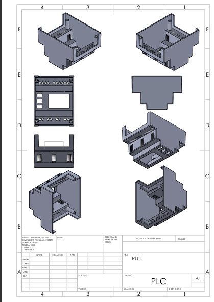
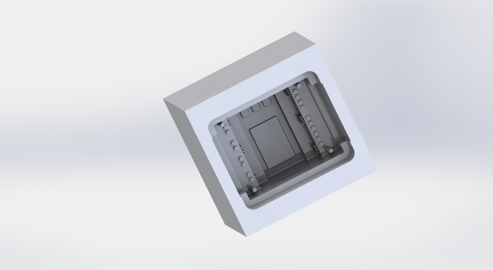
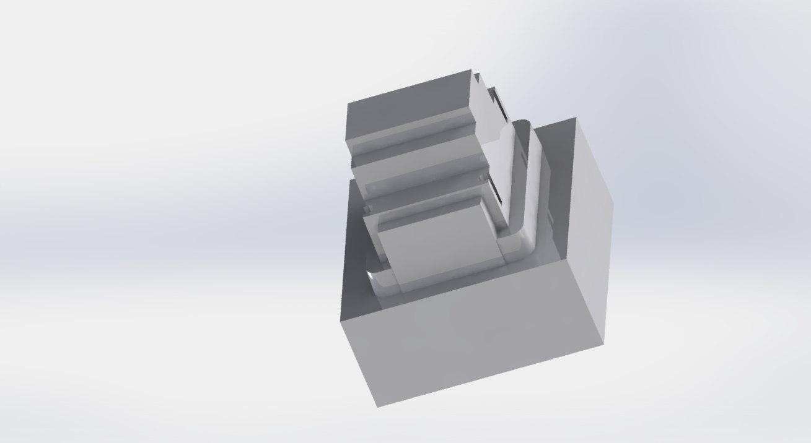
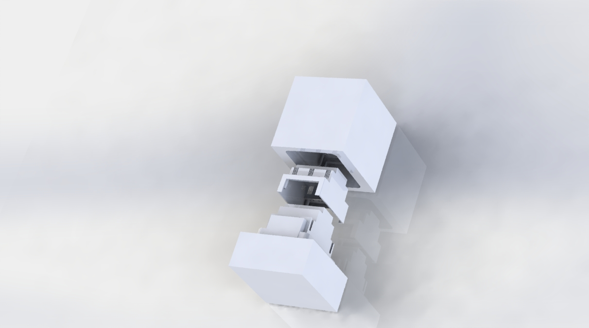
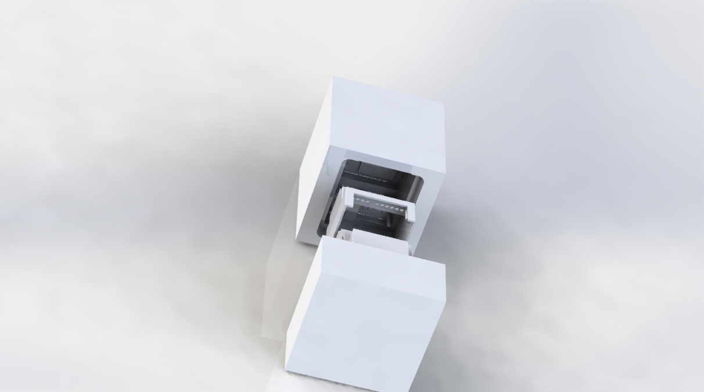
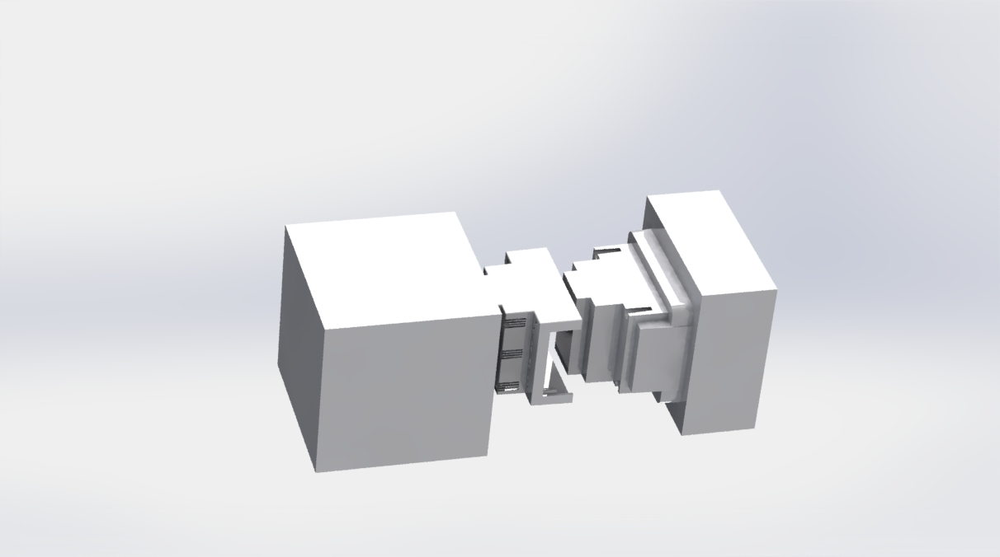

# PLC-3D-Design

## Table of Contents
- [Overview](#overview)
- [Parts](#parts)
- [Cavity and Core](#cavity-and-core)
- [Full Assemble Design Mold Design](#full-assemble-design-mold-design)

## Overview
This repository contains the design files and documentation for a PLC unit, 3D design and its associated mold, created using SolidWorks. The project showcases the complete design process, from initial concept to final 3D models and detailed technical drawings.

## Parts

## Cavity and Core

## Full Assemble Design Mold Design

